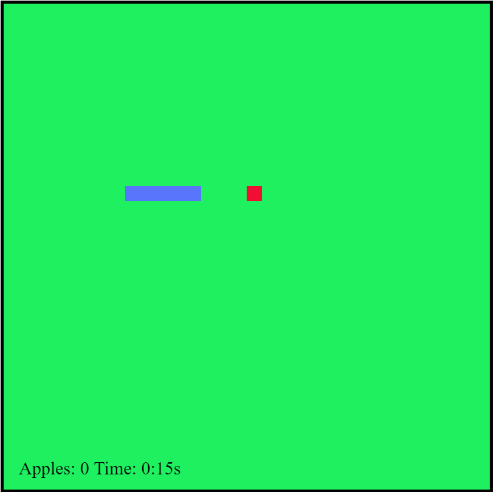
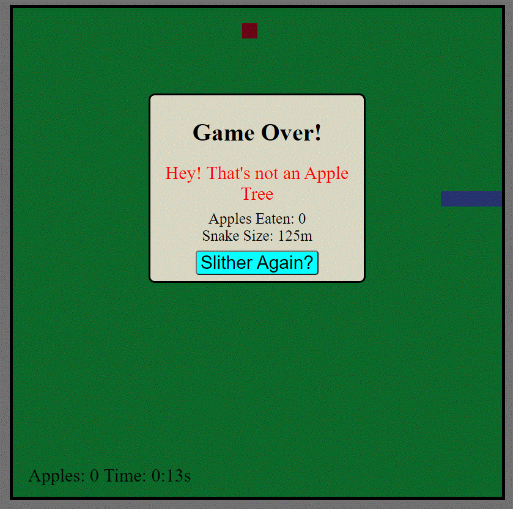

# Snake Game!

Classic Snake game written on basic HTML, CSS, and JavaScript

Play it [here](https://fritzchips.github.io/Snake-Game/)

## Instructions

- Playable on desktop

UP ARROW = Snake Up

LEFT ARROW = Snake Left

RIGHT ARROW = Snake Right

DOWN ARROW = Snake Down

SPACEBAR = Pause Game

Eat Apple:

- +1 Score
- +4s Time
- Snake Size increase

## Be Careful!

- Time is running DOWN!
- Longer Snake = Less time increase
- Watch out for your surroundings!

## Summary

---

I created this project because I want to create video games in the future. This is the first step in that direction. The snake game is developed using `canvas`, the snake and apple objects are redrawn everytime the animation loop is called. The snake moves automatically with `setInterval` allowing the player to chance to interact with other aspects of the board. This was a great experience to show my growth in `JavaScript` and an introduction to objects through the `canvas`. Later down the line this will assist me in learning `C# object oriented programming`.

## Author

---

- **Fritz Solibio** - _Software Developer_ [LinkedIn](https://www.linkedin.com/in/fritz-solibio-4aa9b321b/) | [Website](https://www.fritzsolibio.ca/)
